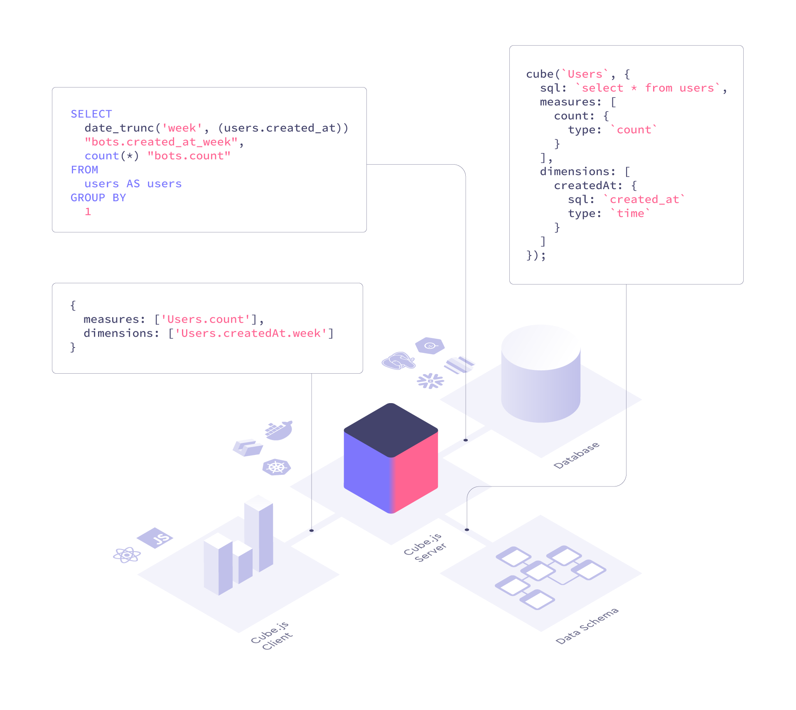

## cube.js基础

cube.js是一个开源分析api平台.主要用于构建内部业务智能工具和对已有应用添加面向用户的分析.

数据分析工具存在的问题:

- 性能
- sql代码管理
- 基础设施

cube.js执行流程

### 核心

核心是sql解析和查询优化.基于redis或缓存来加速查询.

缓存不一致问题

### Pre-Aggregations

预聚合是源数据的压缩版本.用于构建聚合数据和刷新的层.可以显著加速查询和增加并发.

To start building pre-aggregations, Cube.js requires write access to the pre-aggregations schema in the source database. Cube.js first builds pre-aggregations as tables in the source database and then exports them into the pre-aggregations storage.

如果Cube.js找到合适的预聚合规则，则数据库查询将成为一个多阶段过程：

- Cube.js检查是否存在预聚合的最新副本。
- Cube.js将针对预聚合的表而不是原始数据执行查询。

### schema

schema:生成和执行sql